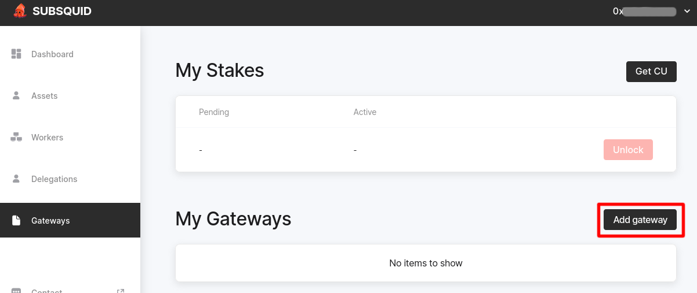

# Run a gateway

Running a gateway enables you to access Subsquid Network data without relying on any centralized services. You can run a private gateway for your own needs, or make a high-throughput public gateway.

In either scenario you will need

* a working Docker installation
* some `SQD` tokens (in your wallet)
* some Arbitrum ETH (for gas)

Hardware requirements depend on how the gateway will be used. A private gateway with a single user can run on a laptop.

## Staking requirements and compute units

All gateways have to be registered on-chain and have a `SQD` stake associated with them to begin serving requests. Size and duration of the stake determine the rate at which the gateway can serve requests.

The exact rate limiting mechanism is based on partitioning time into [_epochs_](/subsquid-network/faq/#epoch). Workers periodically [checks](https://arbiscan.io/address/0x4cf58097d790b193d22ed633bf8b15c9bc4f0da7#readContract#F4) if a new epoch has started (once every 30 seconds by default). When a worker receives its first (on the current epoch) request from a gateway, it makes an [on-chain query](https://arbiscan.io/address/0x8a90a1ce5fa8cf71de9e6f76b7d3c0b72feb8c4b#readProxyContract#F6) for how many _compute units_ (CUs) are allocated to the worker due to any stakes associated with the gateway. The worker keeps the number and decrements it every time it receives more requests from the same gateway. When the CUs are exhausted it begins replying to any new requests from the gateway with HTTP 429 errors. The cycle repeats once the worker detects that a new epoch has begun.

At present, any single data request to worker spends 1 CU. See e.g. [EVM worker API](/subsquid-network/reference/evm-api/#worker-api) to get an idea as to what the requests may look like. By default, the contract allocates the same amount of CUs for each worker, namely
```
(SQD_AMOUNT * EPOCH_LENGTH * BOOST_FACTOR) / (NUM_WORKERS * NUM_GATEWAYS)
```
per epoch. Here,
 * `EPOCH_LENGTH` is 100 and
 * `BOOST_FACTOR` depends on the duration of staking, varying from 1 (stakes under 60 days) to 3 (720 or more days). See [Data consumers](/subsquid-network/whitepaper/#data-consumers) and [Boosters](/subsquid-network/whitepaper/#boosters) sections of the whitepaper.
 * `NUM_WORKERS` is the [number of workers active on the network](https://arbiscan.io/address/0x36e2b147db67e76ab67a4d07c293670ebefcae4e#readContract#F6).
 * `NUM_GATEWAYS` is the number of gateways associated with the wallet that made the stake.

:::info
It is possible to allocate CUs to workers selectively, e.g. to get more bandwidth on some datasets that are served by a subset workers. Currently there's only a low-level interface for this feature. If you're interested, please let us know in [SquidDevs Telegram chat](https://t.me/HydraDevs).
:::

For example, if you expect your gateway to make up to 36k requests to any worker at any epoch, and the network currently has 1000 workers, you will need to stake 30000 SQD if you choose the shortest staking duration and 10000 SQD if you stake for two years or more.

:::tip
By default, your gateway will go down at the end of the staking period. To prevent that, enable the "Auto-extension" option when staking. This will cause your `SQD` to be immediately restaked once the staking period ends. In this setup you have to unstake then wait for the end of the current staking period to withdraw your tokens.
:::

## Running a local gateway

1. Generate your key file by running
   ```bash
   docker run --rm subsquid/rpc-node:0.2.5 keygen > <KEY_PATH>
   ```
   The command will display your peer ID:
   ```
   Your peer ID: <THIS IS WHAT YOU NEED TO COPY>
   ```
   Please copy this ID, as it will be needed for further steps.

   ⚠️ **Note:** Please make sure that the generated file is safe and secure at `<KEY_PATH>` (i.e. it will not be deleted accidentally and cannot be accessed by unauthorized parties).

2. Go to [https://network.subsquid.io](https://network.subsquid.io).

3. Connect your EVM wallet (we recommend using Metamask). Use the wallet that holds the tokens.

4. Go to the "Gateways" tab and click the "Add gateway" button.
   

5. Fill the gateway registration form.
   

   If you plan to make your gateway public, click the "Publicly available" switch and populate the additional fields.
   

   Once done, click "Register" and confirm the transaction.

6. Go to the "Gateways" tab and click the "Get CU" button. Make a `SQD` stake of size and duration appropriate for the planned bandwidth of your gateway (see [Staking requirements and compute units](#staking-requirements-and-compute-units)).

7. Wait for your stake to become active. This will happen at the beginning of the next [epoch](/subsquid-network/faq/#epoch).

8. Clone the gateway repo and enter the folder.
   ```bash
   git clone git clone https://github.com/subsquid/query-gateway
   cd query-gateway
   ```

9. Prepare the environment. Begin with
   ```bash
   cp mainnet.env .env # use tethys.env for the testnet
   ```
   then set the path to your key file:
   ```bash
   echo KEY_PATH=<KEY_PATH> >> .env
   ```

   ⚠️ **Warning:** Be careful when supplying the path to the key you created at step 4. If you make a mistake here, a new random key will be automatically created there and your node will attempt to operate with a new (unregistered) peer ID - unsuccessfully.

10. Run your gateway. You can either utilize a pre-built Docker image:
    ```bash
    docker compose up -d
    ```
    or build it from source:
    ```bash
    cargo run --release
    ```

## High throughput gateways

The recommended way to make a gateway that can serve a large number of requests is deploy multiple gateways associated with a single wallet:

1. Use a single wallet to register as many peer IDs as you need gateway instances.
2. Make one `SQD` stake for all your future gateway instances. See [Staking requirements and compute-units](#staking-requirements-and-compute-units) to get an idea of how large your stake should be.
3. Run gateways in parallel, balancing traffic between the instances.

If you plan to automate running your gateway instances, you may find [this helm chart](https://github.com/subsquid/query-gateway/tree/master/chart) useful.
