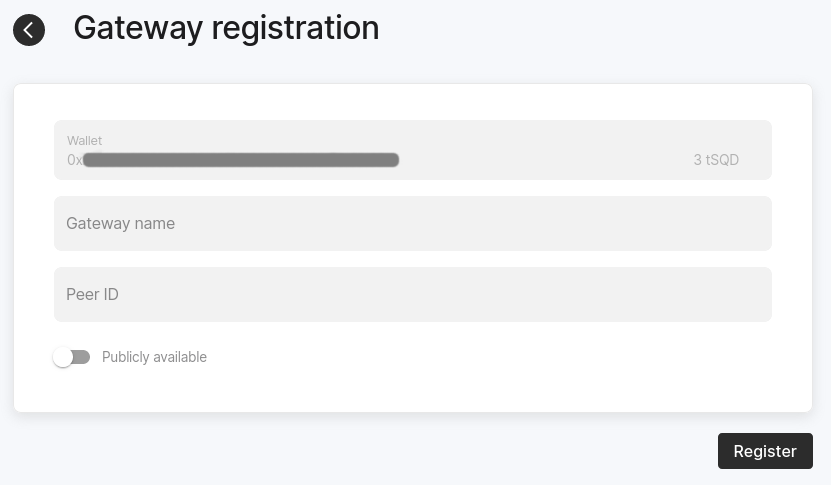
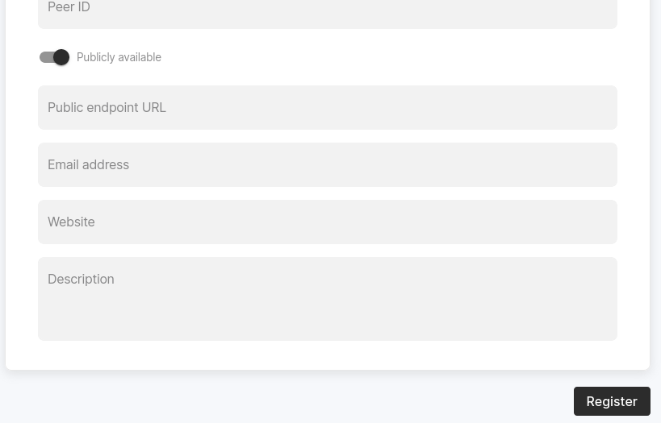

# Run a gateway

Running a gateway enables you to access Subsquid Network data without relying on any centralized services. You can run a private gateway for your own needs, or a high-throughput public gateway.

In either scenario you will need

* a working Docker installation
* some `SQD` tokens (in your wallet, not in a vesting contract)
* some Arbitrum ETH (for gas)

Hardware requirements depend on how the gateway will be used. A private gateway with a single user can run on a laptop; see [High throughput gateways](#high-throughput-gateways) for a discussion of requirements of these setups.

## Staking requirements and compute units

All gateways have to be registered on-chain and have a `SQD` stake associated with them to begin serving requests.

Once every _epoch_ (currently ??? Arbitrum??? blocks) every worker fetches the list of gateways from the blockchain and allocates _compute units_ (CUs) to gateways based on their stakes. The allocation is decremented every time the gateway makes a request to the worker. If it reaches zero, the worker will reply with an HTTP 429 error instead of sending the data.

At present, any worker query spends 1 CU (see e.g. [EVM worker API](/subsquid-network/reference/evm-api/#worker-api) to get an idea as to what the queries may look like). The amount of CU allocated at each epoch is calculated as `4000*SQD_AMOUNT*BOOST_FACTOR`, where `BOOST_FACTOR` is depends on the duration of staking and varies from 1 (stakes under 60 days) to 3 (720 or more days). See [Data consumers](/subsquid-network/whitepaper/#data-consumers) and [Boosters](/subsquid-network/whitepaper/#boosters) sections of the whitepaper for details.

For example, if you expect your gateway to make up to 12k requests to any worker at any epoch, you will need to stake 3 SQD if you choose the shortest staking duration and 1 SQD if you stake for two years or more.

:::tip
By default, your gateway will go down at the end of the staking period. To prevent that, enable the "Auto-extension" option when staking. This will cause your `SQD` to be immediately restaked once the staking period ends. In this setup you have to unstake, then wait for the end of the current staking period to withdraw your tokens.
:::

See [Registering your gateway](#registering-your-gateway) for details on how to use our [Network app](https://network.subsquid.io) to get your gateway registered on-chain and stake your `SQD` on it.

## Installation

### Docker image

Prebuilt `query-gateway` images are [available from Docker Hub](https://hub.docker.com/r/subsquid/query-gateway). Fetch it with
```bash
docker pull subsquid/query-gateway:1.0.0
```

### Building from the source

Install Rust, e.g. with
```bash
curl --proto '=https' --tlsv1.2 -sSf https://sh.rustup.rs | sh
```
Then, clone the repo and build the `query-gateway` binary:
```bash
git clone https://github.com/subsquid/query-gateway
cd query-gateway
cargo build --release --bin query-gateway 
```
This creates the binary at `./target/release/query-gateway`. You can keep it there or install it to `~/.cargo/bin` with
```bash
cargo install --path .
```

## Registering your gateway

1. Generate your key file by running
   ```bash
   docker run --rm subsquid/rpc-node:0.2.5 keygen > <KEY_PATH>
   ```
   The command will display your peer ID:
   ```
   Your peer ID: <THIS IS WHAT YOU NEED TO COPY>
   ```
   Please copy this ID, as it will be needed for further steps.

   ⚠ **Note:** Please make sure that the generated file is safe and secure at `<KEY_PATH>` (i.e. it will not be deleted accidentally and cannot be accessed by unauthorized parties).

2. Go to [https://network.subsquid.io](https://network.subsquid.io).

3. Connect your EVM wallet (we recommend using Metamask). Use the Primary Wallet holding the tokens or linked to the vesting contract.

4. Go to the "Gateways" tab and click the "Add gateway" button.
   

5. Fill the gateway registration form.
   

   If you plan to make your gateway public, click the "Publicly available" switch and populate the additional fields.
   

   Once done, click "Register" and confirm the transaction.

6. Go to the "Gateways" tab and click the "Get CU" button. Make a `SQD` stake of size and duration appropriate for the planned bandwidth of your gateway (see [Staking requirements and compute units](#staking-requirements-and-compute-units)).

7. Wait for your stake to become active. This will happen at the beginning of the next epoch (in ~??? minutes at most).

## Running your gateway

## High throughput gateways
